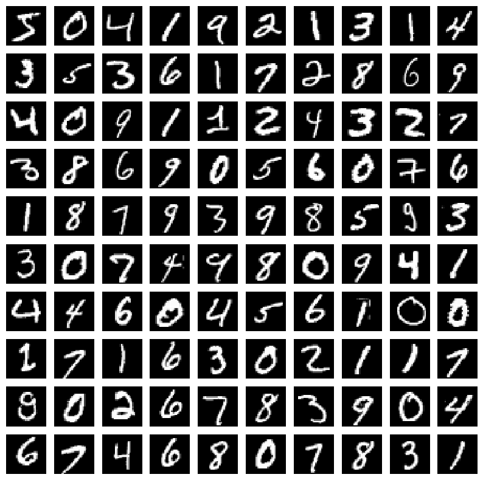
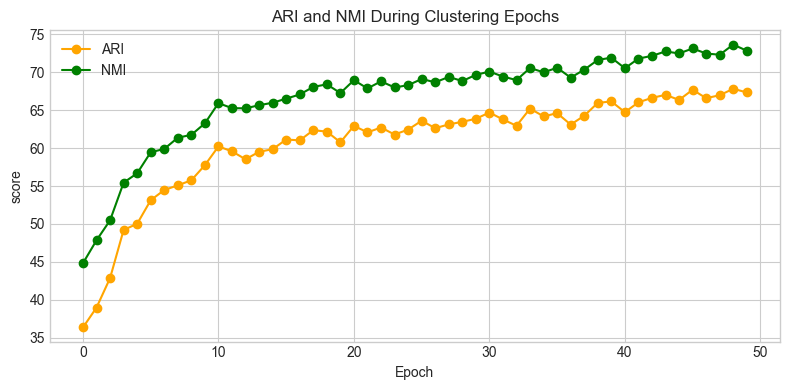
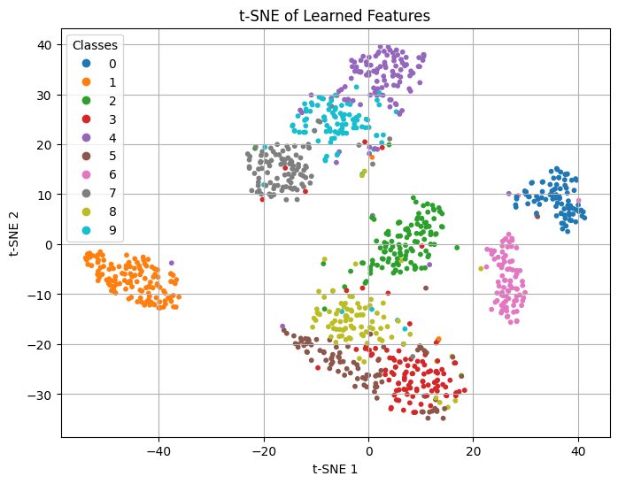

## GMVAE: Gaussian Mixture Variational Autoencoder

This repository contains a PyTorch implementation of a Gaussian Mixture Variational Autoencoder (GMVAE) for unsupervised clustering.

The code is originally from : [@jariasf](https://github.com/jariasf/GMVAE)

I have added some minor changes.

### Install requirements

* Scikit-learn:

`pip install -U scikit-learn`

* Pytorch:

`pip install torch torchvision` (without CUDA) or 

`pip install torch torchvision --index-url https://download.pytorch.org/whl/cu126` (with CUDA 12.6)

* Pandas and Matplot:

`pip install pandas` , `pip install matplotlib `

### Experiment

#### Dataset

The dataset used for the experiments is the [mnist dataset](https://docs.pytorch.org/vision/main/generated/torchvision.datasets.MNIST.html):

#### Training per 50 epochs

The ARI and NMI scores during the training:

The ARI, NMI, ACC scores on the test set: 

| NMI   | ARI | ACC |
|-------|-----|------------|
| 72.84 |67.34|78.28|

Visualisation of the feature latent space

#### Training per 100 epochs